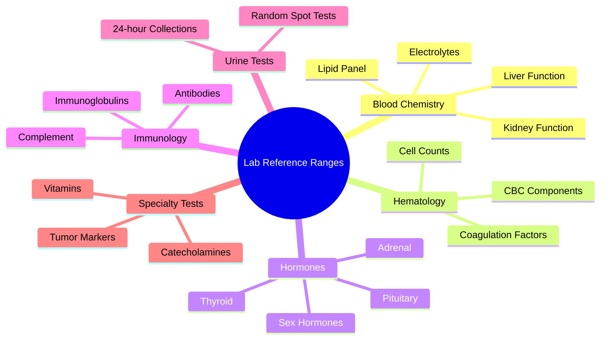
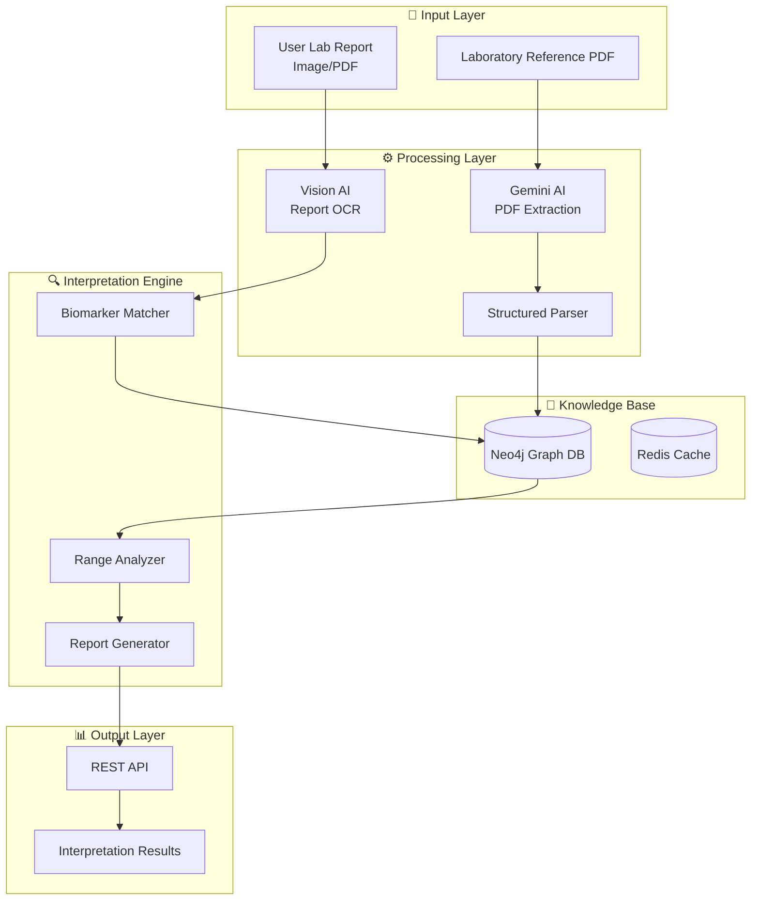
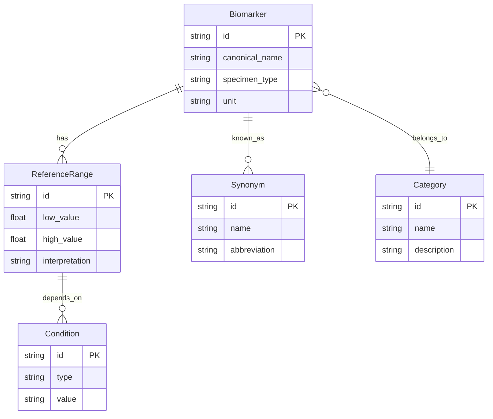
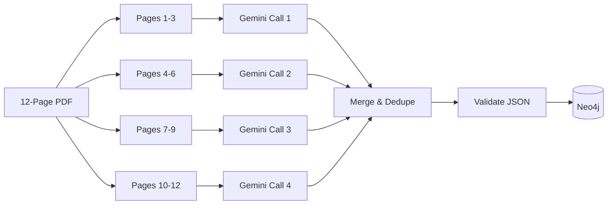

# Lab Report Interpretation System - Implementation Plan

> **Phase 1**: Building the Structured Knowledge Base from ABIM Laboratory Reference Ranges

---

## 1. PDF Analysis Summary

### Document Overview
| Attribute | Value |
|-----------|-------|
| **Source** | ABIM Laboratory Test Reference Ranges (January 2026) |
| **Pages** | 12 |
| **Total Biomarkers** | ~200+ unique tests |
| **File Location** | `backend_fastapi/data/laboratory-reference-ranges.pdf` |

### Data Categories Identified


### Complexity Factors
1. **Conditional Values**: Many tests have ranges that vary by:
   - **Sex**: Male vs Female (e.g., Hemoglobin, Testosterone)
   - **Age**: Pediatric vs Adult vs Postmenopausal
   - **State**: Supine vs Standing, Fasting vs Non-fasting
   - **Diet**: Normal vs Low-sodium diet

2. **Synonym Mapping Required**:
   - `ALT` = `SGPT` = `Alanine Aminotransferase`
   - `AST` = `SGOT` = `Aspartate Aminotransferase`
   - `Hb` = `Hgb` = `Hemoglobin`
   - `BUN` = `Blood Urea Nitrogen`

3. **Unit Variations**: `μg/mL`, `mg/24 hr`, `mEq/L`, `pg/mL`, `ng/dL`, etc.

---

## 2. System Architecture



---

## 3. Neo4j Graph Schema Design

### Node Types



### Example Graph Structure

```cypher
// Hemoglobin with sex-specific ranges
(:Biomarker {
    id: "hemoglobin",
    canonical_name: "Hemoglobin",
    specimen_type: "blood",
    unit: "g/dL"
})
-[:HAS_RANGE]->
(:ReferenceRange {
    low_value: 14.0,
    high_value: 18.0
})
-[:WHEN]->
(:Condition {type: "sex", value: "male"})

// Synonym relationships
(:Synonym {name: "Hb"})-[:ALIAS_OF]->(:Biomarker {id: "hemoglobin"})
(:Synonym {name: "Hgb"})-[:ALIAS_OF]->(:Biomarker {id: "hemoglobin"})
```

---

## 4. JSON Schema for Extraction

```json
{
  "$schema": "http://json-schema.org/draft-07/schema#",
  "type": "object",
  "properties": {
    "biomarkers": {
      "type": "array",
      "items": {
        "type": "object",
        "required": ["id", "canonical_name", "unit", "reference_ranges"],
        "properties": {
          "id": {
            "type": "string",
            "description": "Unique lowercase identifier with underscores"
          },
          "canonical_name": {
            "type": "string",
            "description": "Official test name"
          },
          "synonyms": {
            "type": "array",
            "items": {"type": "string"},
            "description": "Alternative names and abbreviations"
          },
          "category": {
            "type": "string",
            "enum": ["blood_chemistry", "hematology", "hormones", "immunology", "urine", "coagulation", "specialty"]
          },
          "specimen_type": {
            "type": "string",
            "enum": ["blood", "serum", "plasma", "urine", "csf", "whole_blood"]
          },
          "unit": {
            "type": "string",
            "description": "Measurement unit (e.g., mg/dL, μg/mL)"
          },
          "reference_ranges": {
            "type": "array",
            "items": {
              "type": "object",
              "properties": {
                "low_value": {"type": ["number", "null"]},
                "high_value": {"type": ["number", "null"]},
                "conditions": {
                  "type": "object",
                  "properties": {
                    "sex": {"enum": ["male", "female", null]},
                    "age_group": {"type": ["string", "null"]},
                    "state": {"type": ["string", "null"]},
                    "diet": {"type": ["string", "null"]}
                  }
                },
                "interpretation": {
                  "type": "string",
                  "description": "Clinical interpretation notes"
                }
              }
            }
          }
        }
      }
    }
  }
}
```

### Example Extracted JSON

```json
{
  "biomarkers": [
    {
      "id": "hemoglobin",
      "canonical_name": "Hemoglobin",
      "synonyms": ["Hb", "Hgb"],
      "category": "hematology",
      "specimen_type": "blood",
      "unit": "g/dL",
      "reference_ranges": [
        {
          "low_value": 12.0,
          "high_value": 16.0,
          "conditions": {"sex": "female"},
          "interpretation": "Normal range for adult females"
        },
        {
          "low_value": 14.0,
          "high_value": 18.0,
          "conditions": {"sex": "male"},
          "interpretation": "Normal range for adult males"
        }
      ]
    },
    {
      "id": "aldosterone_plasma",
      "canonical_name": "Aldosterone, plasma",
      "synonyms": [],
      "category": "hormones",
      "specimen_type": "plasma",
      "unit": "ng/dL",
      "reference_ranges": [
        {
          "low_value": null,
          "high_value": 10.0,
          "conditions": {"state": "supine_or_seated"},
          "interpretation": "Normal supine/seated"
        },
        {
          "low_value": null,
          "high_value": 21.0,
          "conditions": {"state": "standing"},
          "interpretation": "Normal standing"
        },
        {
          "low_value": null,
          "high_value": 30.0,
          "conditions": {"state": "supine", "diet": "low_sodium"},
          "interpretation": "Normal on low sodium diet"
        }
      ]
    }
  ]
}
```

---

## 5. Gemini Extraction Pipeline

### Processing Strategy
Process PDF in **3-5 page chunks** for maximum accuracy:



### Gemini System Prompt

```text
You are a Medical Data Architect specialized in clinical informatics. 
Your task is to convert the attached laboratory reference ranges 
into a structured JSON format.

CRITICAL RULES:
1. DE-DUPLICATE: Map synonyms to a single canonical Biomarker name
   - Example: "ALT", "SGPT", "Alanine Aminotransferase" → canonical: "Aminotransferase, serum alanine"
   
2. CONDITIONAL LOGIC: Capture all variables:
   - Sex: Male/Female
   - Age_Group: "16-24", "Postmenopausal", "Pediatric", etc.
   - State: "Supine", "Standing", "Fasting"
   - Diet: "Normal", "Low sodium"

3. UNIT PRESERVATION: Keep exact units (μg/mL, mg/24 hr, mEq/L)

4. NUMERIC RANGES:
   - Split into low_value and high_value as floats
   - Use null if no lower bound (e.g., "<10" → low: null, high: 10)
   - Use null if no upper bound (e.g., ">100" → low: 100, high: null)

5. OUTPUT: Return ONLY valid JSON matching the provided schema.
```

---

## 6. Database Options Analysis

| Database | Pros | Cons | Recommendation |
|----------|------|------|----------------|
| **Neo4j** | Native graph queries, relationship traversal, visual exploration | Learning curve, hosting complexity | ✅ **Best for complex relationships** |
| **PostgreSQL + JSONB** | Familiar SQL, flexible JSON storage, good indexing | Less natural for graph queries | Good alternative if Neo4j too complex |
| **MongoDB** | Document flexibility, easy setup | No native graph support | ❌ Not ideal for relationships |
| **SQLite + JSON** | Zero setup, portable | Limited query capability | ❌ Not scalable |

### Recommended: **Neo4j Aura Free Tier** or **PostgreSQL with JSONB**

---

## 7. Implementation Phases

### Phase 1A: PDF Extraction (This Sprint)
```
[ ] Set up Gemini API integration
[ ] Create PDF page chunking utility
[ ] Build extraction prompt with JSON schema
[ ] Extract pages 1-4 (test run)
[ ] Validate and refine prompt
[ ] Extract remaining pages
[ ] Merge and deduplicate results
[ ] Save to biomarkers.json
```

### Phase 1B: Knowledge Base Setup
```
[ ] Choose database (Neo4j vs PostgreSQL)
[ ] Design Cypher/SQL schema
[ ] Write ingestion script
[ ] Load biomarkers.json into database
[ ] Create indexes for fast lookup
[ ] Build synonym resolution queries
```

### Phase 2: Lab Report Interpretation API
```
[ ] Build OCR pipeline for uploaded reports
[ ] Create biomarker matching service
[ ] Implement range comparison logic
[ ] Generate interpretation results
[ ] Build REST API endpoints
[ ] Integrate with HealthMate frontend
```

---

## 8. Key Decisions Required

> [!IMPORTANT]
> **User input needed on the following:**

1. **Database Choice**: 
   - Neo4j (better for graph relationships) 
   - PostgreSQL + JSONB (simpler setup, team familiarity)

2. **Extraction Approach**:
   - Gemini API (recommended for accuracy)
   - Local LLM (privacy, but less accurate)

3. **Scope for Phase 1**:
   - Full 200+ biomarkers extraction
   - Start with high-priority subset (CBC, Metabolic Panel, Lipid Panel)

4. **Integration Point**:
   - Standalone microservice
   - Integrated into existing FastAPI backend

---

## 9. File Structure Proposal

```
backend_fastapi/
├── data/
│   ├── laboratory-reference-ranges.pdf    # Source PDF
│   ├── biomarkers.json                    # Extracted data
│   └── synonyms.json                      # Synonym mappings
├── app/
│   └── lab_interpreter/                   # New module
│       ├── __init__.py
│       ├── extractor/
│       │   ├── pdf_chunker.py
│       │   ├── gemini_extractor.py
│       │   └── json_validator.py
│       ├── database/
│       │   ├── neo4j_client.py
│       │   ├── schema.cypher
│       │   └── ingestion.py
│       ├── services/
│       │   ├── biomarker_matcher.py
│       │   ├── range_analyzer.py
│       │   └── report_generator.py
│       ├── models/
│       │   ├── biomarker.py
│       │   └── interpretation.py
│       └── routers/
│           └── lab_report_router.py
```

---

## 10. Next Steps

1. **Approve this implementation plan**
2. Begin Phase 1A: Gemini-based PDF extraction
3. Set up chosen database
4. Build extraction pipeline
5. Validate extracted data quality
6. Proceed to Phase 2 (interpretation engine)

---

*Document created: January 23, 2026*  
*Project: HealthMate Lab Report Interpretation System*
