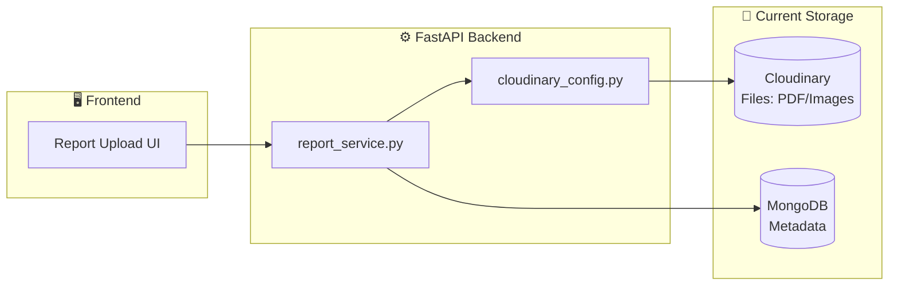
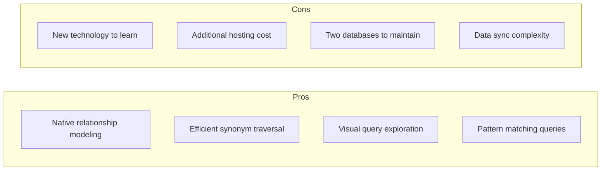
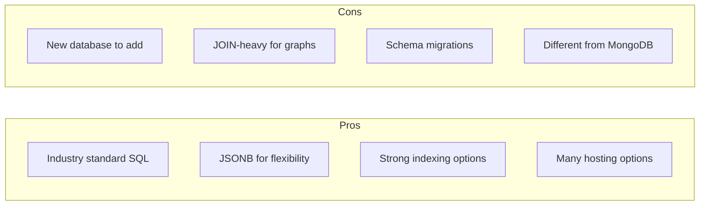
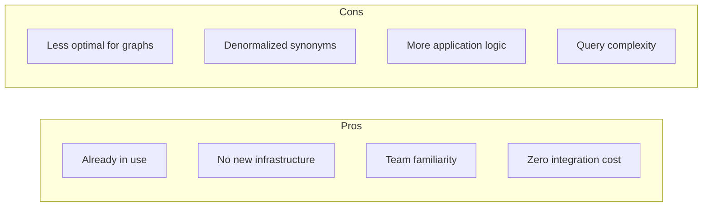
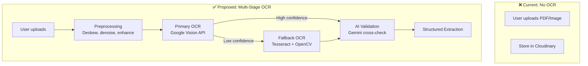
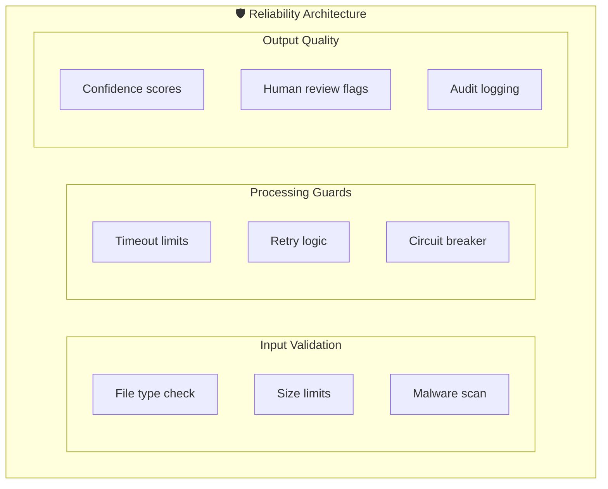
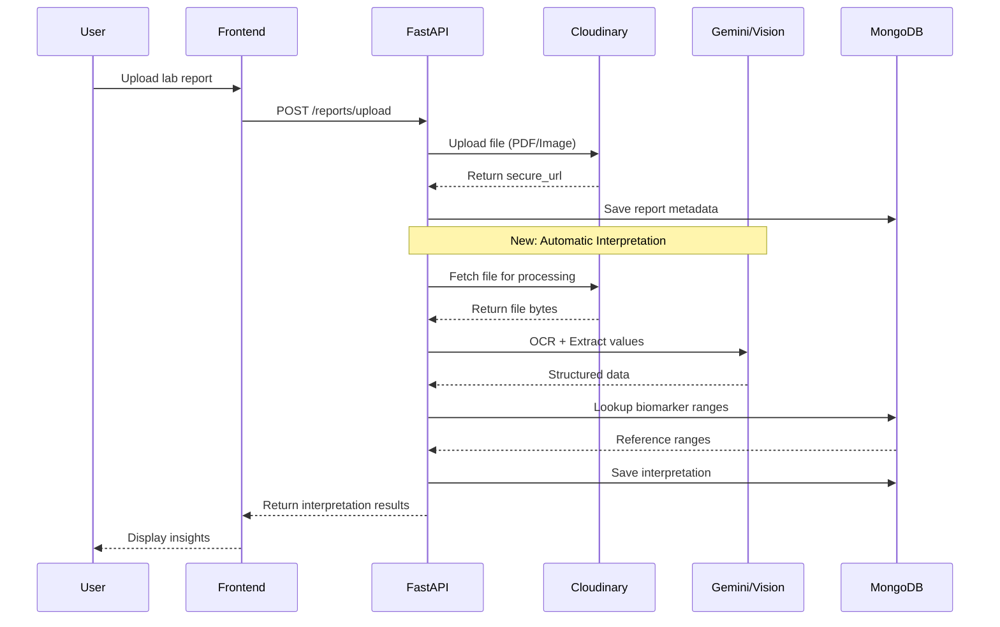

# Lab Report Interpretation System - Deep Analysis & Improvements

> **Comprehensive analysis of database options, accuracy improvements, and reliability strategies**

---

## 1. Current System Architecture

### Existing Infrastructure


### Current Data Flow
| Component | Purpose | Technology |
|-----------|---------|------------|
| File Storage | Store PDFs, images, videos | **Cloudinary** |
| Metadata | Report info, access control | **MongoDB** |
| User Management | Authentication, profiles | **MongoDB** |

---

## 2. Database Analysis: Neo4j vs SQL vs MongoDB

### 2.1 Requirement-Based Comparison

| Requirement | Neo4j | PostgreSQL | MongoDB (Current) |
|-------------|-------|------------|-------------------|
| **Biomarker relationships** | ⭐⭐⭐⭐⭐ Native | ⭐⭐⭐ JOIN heavy | ⭐⭐ Embedded docs |
| **Synonym resolution** | ⭐⭐⭐⭐⭐ Graph traversal | ⭐⭐⭐ Lookup tables | ⭐⭐ Array search |
| **Conditional ranges** | ⭐⭐⭐⭐ Relationship properties | ⭐⭐⭐⭐ JSONB | ⭐⭐⭐⭐ Nested docs |
| **Query flexibility** | ⭐⭐⭐⭐ Cypher | ⭐⭐⭐⭐⭐ SQL | ⭐⭐⭐ Aggregation |
| **Team familiarity** | ⭐⭐ Learning curve | ⭐⭐⭐⭐ Common | ⭐⭐⭐⭐⭐ Already using |
| **Hosting complexity** | ⭐⭐ Neo4j Aura | ⭐⭐⭐⭐ Many options | ⭐⭐⭐⭐⭐ MongoDB Atlas |
| **Cost** | ⭐⭐ Free tier limited | ⭐⭐⭐⭐ Free tiers | ⭐⭐⭐⭐⭐ Already using |
| **Integration effort** | ⭐⭐ New driver | ⭐⭐⭐ New driver | ⭐⭐⭐⭐⭐ Zero effort |

### 2.2 Deep Technical Analysis

#### **Option A: Neo4j (Graph Database)**



**Use Case Fit**:
```cypher
// Finding hemoglobin reference by synonym
MATCH (s:Synonym {name: "Hgb"})-[:ALIAS_OF]->(b:Biomarker)
MATCH (b)-[:HAS_RANGE]->(r:ReferenceRange)-[:WHEN]->(c:Condition {sex: "male"})
RETURN b.canonical_name, r.low_value, r.high_value, b.unit
```

**Verdict**: ✅ **Best for complex biomarker relationships** but adds operational complexity.

---

#### **Option B: PostgreSQL + JSONB**



**Use Case Fit**:
```sql
-- Finding hemoglobin reference by synonym
SELECT b.canonical_name, r.low_value, r.high_value, b.unit
FROM biomarkers b
JOIN biomarker_synonyms s ON b.id = s.biomarker_id
JOIN reference_ranges r ON b.id = r.biomarker_id
WHERE s.synonym ILIKE ANY(ARRAY['hgb', 'hb', 'hemoglobin'])
  AND r.conditions->>'sex' = 'male';
```

**Verdict**: ⚠️ **Good alternative** if team prefers SQL, but adds database to manage.

---

#### **Option C: MongoDB (Extend Current)**



**Schema Design**:
```json
{
  "_id": "hemoglobin",
  "canonical_name": "Hemoglobin",
  "synonyms": ["Hb", "Hgb", "Haemoglobin"],
  "category": "hematology",
  "specimen_type": "blood",
  "unit": "g/dL",
  "reference_ranges": [
    {
      "low_value": 12.0,
      "high_value": 16.0,
      "conditions": {"sex": "female"},
      "interpretation": "Normal for adult females"
    },
    {
      "low_value": 14.0,
      "high_value": 18.0,
      "conditions": {"sex": "male"},
      "interpretation": "Normal for adult males"
    }
  ]
}
```

**Use Case Fit**:
```javascript
// Finding hemoglobin reference by synonym
db.biomarkers.findOne({
  $or: [
    { _id: { $regex: /hemoglobin/i } },
    { synonyms: { $regex: /^hgb$/i } }
  ]
}, {
  reference_ranges: {
    $elemMatch: { "conditions.sex": "male" }
  }
})
```

**Verdict**: ✅ **Recommended for simplicity** - extend existing MongoDB with dedicated collection.

---

### 2.3 Final Recommendation

> [!IMPORTANT]
> **Recommended Architecture: MongoDB with Dedicated Biomarker Collection**

| Factor | Decision |
|--------|----------|
| **Primary Database** | MongoDB (extend existing) |
| **Biomarker Storage** | New `biomarkers` collection |
| **File Storage** | Cloudinary (keep as is) |
| **Caching** | Redis (optional, for synonym lookups) |

**Rationale**:
1. **Zero new infrastructure** - Already using MongoDB
2. **Faster development** - Team already knows MongoDB
3. **Single source of truth** - All data in one database
4. **Sufficient for 200 biomarkers** - Graph DB overkill for this scale
5. **Easy indexing** - Create compound indexes on synonyms

---

## 3. Accuracy & Reliability Improvements

### 3.1 OCR Accuracy Improvements



#### Improvement Strategies

| Strategy | Impact | Implementation |
|----------|--------|----------------|
| **Image Preprocessing** | +30% accuracy | OpenCV: deskew, denoise, contrast |
| **Multi-OCR Ensemble** | +15% accuracy | Google Vision + Tesseract fallback |
| **AI Post-Processing** | +20% accuracy | Gemini to validate/correct OCR output |
| **Confidence Scoring** | +10% reliability | Flag low-confidence extractions |
| **Lab-Specific Templates** | +25% accuracy | Custom extractors for common labs |

### 3.2 Biomarker Matching Improvements

```mermaid
flowchart LR
    subgraph Matching["🔍 Biomarker Matching Pipeline"]
        Input[OCR Text:<br/>"Hgb: 14.2 g/dL"]
        
        subgraph Stage1["Stage 1: Exact Match"]
            E1[Direct lookup in synonyms]
        end
        
        subgraph Stage2["Stage 2: Fuzzy Match"]
            F1[Levenshtein distance]
            F2[Phonetic matching]
        end
        
        subgraph Stage3["Stage 3: AI Match"]
            A1[Gemini semantic matching]
        end
        
        Output[Matched:<br/>Hemoglobin]
    end
    
    Input --> E1
    E1 -->|Not found| F1 --> F2
    F2 -->|Not found| A1
    E1 -->|Found| Output
    F2 -->|Found| Output
    A1 --> Output
```

#### Matching Strategy Details

| Strategy | Description | Accuracy |
|----------|-------------|----------|
| **Exact Match** | Direct synonym lookup | 70% |
| **Normalized Match** | Lowercase, remove spaces/special chars | 85% |
| **Fuzzy Match** | Levenshtein < 2 edits | 92% |
| **Phonetic Match** | Soundex/Metaphone for typos | 95% |
| **AI Semantic Match** | Gemini for complex abbreviations | 98% |

### 3.3 Reference Range Resolution

```python
# Example: Conditional Range Resolution
def get_reference_range(biomarker_id: str, patient_context: dict) -> dict:
    """
    Resolve correct reference range based on patient context.
    
    patient_context = {
        "sex": "male",
        "age": 45,
        "is_pregnant": False,
        "is_fasting": True,
        "posture": "standing"  # or "supine"
    }
    """
    biomarker = db.biomarkers.find_one({"_id": biomarker_id})
    
    # Score each range by matching conditions
    best_match = None
    best_score = 0
    
    for range_entry in biomarker["reference_ranges"]:
        score = calculate_condition_match(range_entry["conditions"], patient_context)
        if score > best_score:
            best_score = score
            best_match = range_entry
    
    return best_match
```

### 3.4 Reliability Improvements



#### Reliability Strategies

| Strategy | Implementation | Benefit |
|----------|----------------|---------|
| **Retry with Exponential Backoff** | Retry OCR/AI calls 3x with 1s, 2s, 4s delays | Handle transient failures |
| **Circuit Breaker** | Disable feature if >50% failures in 5 min | Prevent cascade failures |
| **Fallback Pipeline** | If primary OCR fails, use secondary | Always get result |
| **Confidence Thresholds** | Flag results with <80% confidence | Quality control |
| **Audit Logging** | Log all interpretations with metadata | Debugging + compliance |
| **Rate Limiting** | Max 10 reports/min per user | Prevent abuse |
| **Idempotency** | Prevent duplicate processing | Data consistency |

---

## 4. Enhanced Data Model for MongoDB

### 4.1 Biomarker Collection Schema

```javascript
// Collection: biomarkers
{
  "_id": "hemoglobin_blood",  // Unique canonical ID
  "canonical_name": "Hemoglobin",
  "display_name": "Hemoglobin (Hb)",
  
  // Synonym matching - indexed for fast lookup
  "synonyms": ["Hb", "Hgb", "Haemoglobin", "Hemoglobin A1c"],
  "synonyms_normalized": ["hb", "hgb", "haemoglobin", "hemoglobin a1c"],
  
  // Classification
  "category": "hematology",
  "subcategory": "complete_blood_count",
  "specimen_types": ["blood", "whole_blood"],
  
  // Measurement
  "unit": "g/dL",
  "alternate_units": [
    {"unit": "g/L", "conversion_factor": 10}
  ],
  
  // Reference ranges with conditions
  "reference_ranges": [
    {
      "id": "adult_male",
      "low_value": 14.0,
      "high_value": 18.0,
      "conditions": {
        "sex": "male",
        "age_min": 18,
        "age_max": null  // No upper limit
      },
      "interpretation": {
        "low": "Anemia - may indicate iron deficiency, chronic disease, or blood loss",
        "normal": "Within normal limits",
        "high": "Polycythemia - may indicate dehydration, lung disease, or bone marrow disorder"
      },
      "critical_low": 7.0,
      "critical_high": 20.0
    },
    {
      "id": "adult_female",
      "low_value": 12.0,
      "high_value": 16.0,
      "conditions": {
        "sex": "female",
        "age_min": 18,
        "age_max": null,
        "pregnancy": false
      }
    },
    {
      "id": "pregnant_female",
      "low_value": 11.0,
      "high_value": 14.0,
      "conditions": {
        "sex": "female",
        "pregnancy": true
      },
      "note": "Lower limit due to hemodilution in pregnancy"
    }
  ],
  
  // Metadata
  "source": "ABIM Laboratory Reference Ranges 2026",
  "last_updated": "2026-01-23",
  "created_at": 1737613470000
}
```

### 4.2 Interpretation Result Schema

```javascript
// Collection: lab_interpretations
{
  "_id": ObjectId("..."),
  "user_id": "user_123",
  "report_id": "report_456",  // Link to Cloudinary file
  
  // OCR Results
  "ocr_method": "google_vision",
  "ocr_confidence": 0.94,
  "raw_text": "Complete Blood Count results...",
  
  // Extracted Values
  "extracted_values": [
    {
      "biomarker_id": "hemoglobin_blood",
      "matched_text": "Hgb",
      "match_method": "synonym_exact",
      "match_confidence": 1.0,
      "value": 14.2,
      "unit": "g/dL",
      "reference_range_used": "adult_male",
      "status": "normal",
      "interpretation": "Within normal limits"
    },
    {
      "biomarker_id": "glucose_fasting",
      "matched_text": "Glu, Fasting",
      "match_method": "fuzzy_match",
      "match_confidence": 0.89,
      "value": 126,
      "unit": "mg/dL",
      "reference_range_used": "adult_fasting",
      "status": "high",
      "interpretation": "Elevated - meets diagnostic criteria for diabetes"
    }
  ],
  
  // Patient context used
  "patient_context": {
    "sex": "male",
    "age": 45,
    "is_fasting": true
  },
  
  // Quality metrics
  "overall_confidence": 0.91,
  "flagged_for_review": false,
  "review_reasons": [],
  
  // Timestamps
  "created_at": 1737613470000,
  "processed_in_ms": 2340
}
```

### 4.3 Indexes for Performance

```javascript
// Biomarker lookup indexes
db.biomarkers.createIndex({ "synonyms_normalized": 1 })
db.biomarkers.createIndex({ "category": 1, "subcategory": 1 })
db.biomarkers.createIndex({ "canonical_name": "text", "synonyms": "text" })

// Interpretation indexes
db.lab_interpretations.createIndex({ "user_id": 1, "created_at": -1 })
db.lab_interpretations.createIndex({ "report_id": 1 }, { unique: true })
```

---

## 5. Integration with Cloudinary

### Current Flow Enhancement



### Enhanced Report Model

```python
# Extended report document
report_doc = {
    "user_id": user_id,
    "file_url": cloudinary_url,
    "file_type": content_type,
    "original_name": filename,
    
    # NEW: Interpretation fields
    "interpretation_status": "pending",  # pending|processing|completed|failed
    "interpretation_id": None,  # Link to lab_interpretations collection
    "processed_at": None,
    
    "uploaded_at": int(time.time() * 1000)
}
```

---

## 6. Priority Implementation Roadmap

### Phase 1: Foundation (Week 1-2)
```
[1] Set up biomarkers collection in MongoDB
[2] Extract ABIM reference ranges using Gemini
[3] Build synonym normalization pipeline
[4] Create biomarker matching service
```

### Phase 2: OCR Pipeline (Week 3-4)
```
[5] Integrate Google Vision API for OCR
[6] Build preprocessing pipeline (OpenCV)
[7] Implement value extraction regex patterns
[8] Add Tesseract fallback
```

### Phase 3: Interpretation Engine (Week 5-6)
```
[9] Build reference range resolver with conditions
[10] Create interpretation result generator
[11] Implement confidence scoring
[12] Add audit logging
```

### Phase 4: Integration & Testing (Week 7-8)
```
[13] Integrate with existing report upload flow
[14] Build interpretation results API endpoints
[15] Create frontend display components
[16] Comprehensive testing & validation
```

---

## 7. Key Decision Summary

| Decision | Choice | Rationale |
|----------|--------|-----------|
| **Database** | MongoDB (extend) | Already in use, sufficient for 200 biomarkers |
| **OCR Primary** | Google Vision API | Best accuracy for medical documents |
| **OCR Fallback** | Tesseract + OpenCV | Free, offline capable |
| **AI Processing** | Gemini 2.0 Flash | Fast, accurate, already integrated |
| **File Storage** | Cloudinary (keep) | Already configured, works well |
| **Caching** | Redis (optional) | Only if synonym lookups become slow |

---

*Document created: January 23, 2026*
*Author: AI System Architect*
*Project: HealthMate Lab Report Interpretation*
