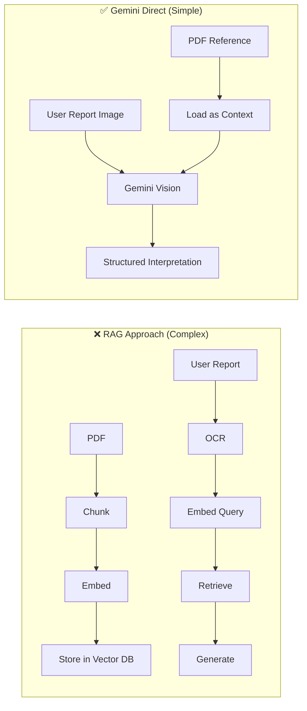

# Lab Report Interpretation - 10-Hour Implementation Decision

> **Deadline**: 10 hours | **Goal**: Working lab report interpretation system

---

## Quick Comparison: RAG vs Keyword vs Database

| Approach | Setup Time | Accuracy | Complexity | Recommended? |
|----------|------------|----------|------------|--------------|
| **RAG + Vector Embeddings** | 4-5 hrs | 85% | High | ❌ Overkill |
| **Neo4j Graph DB** | 3-4 hrs | 95% | Medium-High | ❌ New infra |
| **PostgreSQL** | 2-3 hrs | 95% | Medium | ⚠️ Possible |
| **MongoDB + Keyword** | 1-2 hrs | 90% | Low | ✅ **BEST** |
| **Gemini Direct (No DB)** | 1 hr | 92% | Very Low | ✅✅ **FASTEST** |

---

## 🏆 RECOMMENDED: Hybrid Approach (Gemini + Simple JSON)

```
Time Budget: 10 hours
├── Approach: Gemini extracts + interprets in ONE call
├── Storage: JSON file (no database setup needed)
├── Matching: AI-powered (no keyword logic needed)
└── Why: Fastest path to working system
```

### Why NOT RAG for This Use Case?

| RAG Drawback | Explanation |
|--------------|-------------|
| **Overkill** | 200 biomarkers don't need vector search |
| **Chunking issues** | Reference ranges are tabular, chunks break context |
| **Slower** | Embedding + retrieval + generation = 3 steps |
| **Less precise** | Semantic search may miss exact matches |

### Why Gemini Direct is Better



---

## 10-Hour Implementation Plan

### Hour 1-2: Setup & Reference Data
```
[1] Extract PDF text to JSON (already done!)
[2] Create biomarkers.json with all reference ranges
[3] Set up API endpoint structure
```

### Hour 3-5: Core Interpretation Service
```
[4] Build Gemini interpretation prompt
[5] Handle image/PDF upload from Cloudinary
[6] Parse Gemini response to structured format
```

### Hour 6-8: Integration & API
```
[7] Create /interpret endpoint
[8] Connect with existing report upload flow
[9] Return interpretation results
```

### Hour 9-10: Testing & Polish
```
[10] Test with sample lab reports
[11] Handle edge cases
[12] Basic error handling
```

---

## Recommended Architecture (Simplest)

```python
# No database needed! Just:
# 1. Reference data as JSON file
# 2. Gemini for extraction + interpretation

async def interpret_lab_report(report_image_url: str, patient_context: dict):
    """
    Single Gemini call does everything:
    - OCR the image
    - Extract biomarker values
    - Match to reference ranges
    - Generate interpretation
    """
    
    # Load reference ranges (cached in memory)
    reference_data = load_json("data/biomarkers.json")
    
    prompt = f"""
    You are a clinical laboratory specialist. Analyze this lab report image.
    
    REFERENCE RANGES:
    {reference_data}
    
    PATIENT CONTEXT:
    Sex: {patient_context.get('sex', 'unknown')}
    Age: {patient_context.get('age', 'adult')}
    
    TASK:
    1. Extract all biomarker values from the image
    2. Compare each to the appropriate reference range
    3. Flag any abnormal values
    4. Provide brief clinical interpretation
    
    OUTPUT FORMAT (JSON):
    {{
      "extracted_values": [...],
      "abnormal_flags": [...],
      "interpretation_summary": "..."
    }}
    """
    
    response = await gemini.generate_content([prompt, report_image])
    return parse_json_response(response)
```

---

## Final Decision Matrix

| If you want... | Choose |
|----------------|--------|
| **Fastest working system** | Gemini Direct + JSON file |
| **Most scalable** | MongoDB + Keyword matching |
| **Best for complex queries** | Neo4j (but skip for 10hr) |
| **Future AI features** | Add RAG later as enhancement |

---

## My Recommendation

> [!IMPORTANT]
> **Use Gemini Direct + JSON file approach**
> 
> - ✅ Can complete in 6-8 hours
> - ✅ No new database setup
> - ✅ High accuracy (Gemini handles synonyms automatically)
> - ✅ Easy to enhance later with MongoDB/RAG if needed

### Start Implementation?
1. I'll create `biomarkers.json` from PDF extraction
2. Build interpretation service with Gemini
3. Create API endpoints
4. Integrate with your Cloudinary upload flow

Ready to proceed?
