```mermaid
flowchart LR
    A[Total Doses: 10] --> B{Count Taken}
    B --> C[Taken: 8]
    B --> D[Missed: 2]
    C --> E["8/10 × 100 = 80%"]
```

```mermaid
flowchart TB
    subgraph Week["Last 7 Days"]
        D1["Mon ✅"]
        D2["Tue ✅"]
        D3["Wed ❌ Missed 1"]
        D4["Thu ✅"]
        D5["Fri ✅"]
        D6["Sat ✅"]
        D7["Sun ✅ (Today)"]
    end
    
    D7 --> |Skip Today| D6
    D6 --> |Perfect| D5
    D5 --> |Perfect| D4
    D4 --> |Perfect| D3
    D3 --> |BROKEN| STOP[Streak = 3 days]
```

# Health Insights System - Complete Technical Documentation

## Table of Contents
1. [Overview](#overview)
2. [Architecture](#architecture)
3. [Feature Logic Deep Dive](#feature-logic-deep-dive)
4. [Identified Flaws](#identified-flaws)
5. [Improvement Recommendations](#improvement-recommendations)
6. [API Reference](#api-reference)
7. [Frontend Integration](#frontend-integration)

---

## Overview

The Health Insights system provides comprehensive medication adherence analytics for HealthMate users. It tracks dose events, calculates adherence metrics, identifies patterns, and provides AI-powered recommendations.

### Key Features
| Feature | Description |
|---------|-------------|
| **Adherence Score** | Percentage of doses taken vs scheduled |
| **Streak Tracking** | Consecutive days with 100% adherence |
| **Time-of-Day Analysis** | When users miss doses most |
| **Week Comparison** | This week vs last week trends |
| **Calendar Heatmap** | Daily adherence visualization |
| **AI Insights** | Gemini-powered personalized tips |

---

## Architecture


### Data Flow


---

## Feature Logic Deep Dive

### 1. Adherence Score Calculation

**Location:** `dose_history_service.py:168`

**Formula:**
```
Adherence % = (Doses Taken / Total Doses) × 100
```

**Algorithm:**
```python
# Pseudocode
total = 0
taken = 0

for each dose_record in date_range:
    total += 1
    if status == "taken":
        taken += 1

adherence_percentage = (taken / total) * 100 if total > 0 else 100
```

**Diagram:**


**Key Points:**
- Returns 100% if no doses scheduled (edge case)
- Tracks "late" doses separately (>30 min after scheduled)
- Per-medication breakdown available

---

### 2. Streak Calculation

**Location:** `dose_history_service.py:245-315`

**Definition:** A streak is the count of consecutive days with 100% adherence (no missed doses).

**Algorithm:**
```python
# 1. Aggregate doses by date
pipeline = [
    group by date,
    count total, taken, missed
]

# 2. For each day, check if "perfect"
is_perfect = (missed == 0) AND (taken > 0)

# 3. Count consecutive perfect days from yesterday backwards
current_streak = 0
for day in sorted_days_descending:
    if day == today:
        skip  # Today is still in progress
    if day.is_perfect:
        current_streak += 1
    else:
        break  # Streak broken
```

**Diagram:**


**Key Points:**
- Today is excluded (incomplete)
- Best streak ever is tracked separately
- `last_broken_date` shows when streak ended

---

### 3. Time-of-Day Analysis ("When Do You Miss Doses?")

**Location:** `dose_history_service.py:368-462`

**Time Periods:**
| Period | Hours | Description |
|--------|-------|-------------|
| Morning | 06:00 - 11:59 | Before lunch |
| Afternoon | 12:00 - 17:59 | Lunch to evening |
| Evening | 18:00 - 23:59 | After work |
| Night | 00:00 - 05:59 | Late night |

**Algorithm:**
```python
# 1. Extract hour from time_slot (e.g., "08:00" → 8)
hour = int(time_slot.split(":")[0])

# 2. Categorize into period
if 6 <= hour < 12:    period = "morning"
elif 12 <= hour < 18: period = "afternoon"
elif 18 <= hour < 24: period = "evening"
else:                 period = "night"

# 3. Count taken/missed per period
time_periods[period].total += 1
if status == "taken":
    time_periods[period].taken += 1
elif status == "missed":
    time_periods[period].missed += 1

# 4. Find worst period
miss_rate = missed / total * 100
worst_period = max(periods, key=miss_rate)
```

**Diagram:**


---

## Identified Flaws

### Flaw 1: Adherence Shows 100% When No Data
**Location:** Line 168
**Issue:** Returns 100% adherence when `total == 0`
**Impact:** New users see perfect score with no effort
**Severity:** Medium

### Flaw 2: Streak Skips Today Entirely
**Location:** Lines 288-290
**Issue:** If today is the ONLY day with data, streak shows 0
**Impact:** Users don't see their first perfect day count
**Severity:** Low

### Flaw 3: Streak Doesn't Check Consecutive Dates
**Location:** Lines 287-296
**Issue:** Only checks if days are perfect, not if dates are consecutive
**Example:** If user has data for Mon (perfect) and Wed (perfect) but not Tue, streak = 2 (incorrect, should be 1)
**Severity:** High

### Flaw 4: Time Analysis Uses Fixed Periods
**Location:** Lines 398-402
**Issue:** Time periods are hardcoded, no customization
**Impact:** Doesn't account for user's actual schedule
**Severity:** Low

### Flaw 5: Week Comparison Counts Partial Weeks
**Location:** `get_comparison_stats()` 
**Issue:** "This week" means last 7 days, not calendar week
**Impact:** Comparison may be confusing
**Severity:** Low

### Flaw 6: No Timezone Handling
**Location:** All date operations
**Issue:** Uses server timezone, not user's local timezone
**Impact:** Streak broken at wrong time for international users
**Severity:** Medium

---

## Improvement Recommendations

### Priority 1: Fix Consecutive Date Check in Streak

**Current:** Only checks `is_perfect`, not date continuity
**Proposed Fix:**

```python
from datetime import datetime, timedelta

prev_date = None
for day in daily_stats:
    if day["date"] == today:
        continue
    
    current_date = datetime.strptime(day["date"], "%Y-%m-%d")
    
    # Check if consecutive
    if prev_date:
        expected = prev_date - timedelta(days=1)
        if current_date.date() != expected.date():
            break  # Gap in dates - streak broken
    
    if day["is_perfect"]:
        current_streak += 1
        prev_date = current_date
    else:
        break
```

### Priority 2: Handle Empty Data Gracefully

**Current:** Returns 100% adherence for no data
**Proposed Fix:**

```python
if total == 0:
    return {
        "success": True,
        "summary": {
            "adherence_percentage": None,  # Indicates no data
            "total_doses": 0,
            "message": "Start tracking to see your adherence score"
        }
    }
```

### Priority 3: Add User Timezone Support

**Proposed:**
1. Store user's timezone in profile (e.g., "Asia/Kathmandu")
2. Convert server time to user's timezone for all calculations
3. Pass timezone parameter to all date functions

### Priority 4: Include Today's Progress Option

**Proposed:** Add parameter to include today:
```python
async def calculate_streak(user_id: str, include_today: bool = False):
    ...
    if not include_today and day["date"] == today:
        continue
```

### Priority 5: Configurable Time Periods

**Proposed:** Allow users to customize based on their schedule:
```python
# User-defined periods in profile
custom_periods = {
    "early_morning": {"start": 5, "end": 8},
    "work_hours": {"start": 9, "end": 17},
    "evening": {"start": 18, "end": 22}
}
```

---

## API Reference

### GET /api/user/medications/adherence/stats

**Query Parameters:**
| Param | Type | Default | Description |
|-------|------|---------|-------------|
| period | string | "week" | "week", "month", or "all" |
| medication_id | string | null | Filter by specific medication |

**Response:**
```json
{
  "success": true,
  "period": "week",
  "start_date": "2024-12-22",
  "end_date": "2024-12-29",
  "summary": {
    "total_doses": 28,
    "taken": 24,
    "missed": 4,
    "late": 2,
    "adherence_percentage": 85.7,
    "on_time_percentage": 78.6
  },
  "by_medication": {
    "Aspirin": {"taken": 12, "missed": 2, "total": 14, "adherence_percentage": 85.7}
  },
  "by_date": {
    "2024-12-28": {"taken": 4, "missed": 0, "total": 4}
  }
}
```

---

### GET /api/user/medications/adherence/streak

**Response:**
```json
{
  "success": true,
  "current_streak": 5,
  "best_streak": 12,
  "last_broken_date": "2024-12-23",
  "is_perfect_today": true
}
```

---

### GET /api/user/medications/adherence/time-analysis

**Query Parameters:**
| Param | Type | Default |
|-------|------|---------|
| period | string | "week" |

**Response:**
```json
{
  "success": true,
  "time_analysis": [
    {
      "period": "morning",
      "label": "Morning (6AM-12PM)",
      "total": 14,
      "taken": 12,
      "missed": 2,
      "adherence_percentage": 85.7,
      "miss_percentage": 14.3
    }
  ],
  "worst_period": "afternoon",
  "worst_miss_rate": 28.5,
  "insight": "You tend to miss doses most in the afternoon (28.5% miss rate)"
}
```

---

### GET /api/user/medications/adherence/comparison

**Response:**
```json
{
  "success": true,
  "current_week": {"adherence_percentage": 85.0, "total": 28, "taken": 24},
  "previous_week": {"adherence_percentage": 78.0, "total": 28, "taken": 22},
  "delta": 7.0,
  "trend": "improving",
  "insight": "Great progress! You're up 7% from last week."
}
```

---

### GET /api/user/medications/adherence/ai-insights

**Response:**
```json
{
  "success": true,
  "insights": [
    "💡 You miss 3x more doses in the afternoon. Try setting a lunch reminder.",
    "⏰ Your best streak was 12 days - you can beat it!",
    "🎯 Metformin is your most consistent medication at 95%."
  ],
  "generated_at": "2024-12-29T14:30:00Z",
  "data_period": "week"
}
```

---

## Frontend Integration

### File: `frontend/src/pages/user/Analytics.tsx`

**Key Components:**
| Component | Purpose |
|-----------|---------|
| `AdherenceRing` | Animated SVG circle showing percentage |
| `MedicationCard` | Per-medication progress bar |
| `MissedDoseRow` | Row in missed doses history table |

**State Management:**
```typescript
const [adherenceStats, setAdherenceStats] = useState<AdherenceStats | null>(null);
const [streak, setStreak] = useState<StreakResponse | null>(null);
const [timeAnalysis, setTimeAnalysis] = useState<TimeAnalysisResponse | null>(null);
const [comparison, setComparison] = useState<ComparisonResponse | null>(null);
const [aiInsights, setAiInsights] = useState<AIInsightsResponse | null>(null);
```

**Data Fetching:**
```typescript
const fetchData = async () => {
    const [stats, missed, streak, time, comp, ai] = await Promise.all([
        getAdherenceStats(period),
        getMissedDoses(10),
        getStreak(),
        getTimeAnalysis(period),
        getComparison(),
        getAIInsights()
    ]);
    // Set state...
};
```

---

## Database Schema

### Collection: `dose_history`

```javascript
{
  "_id": ObjectId,
  "user_id": String,
  "medication_id": String,
  "medication_name": String,
  "date": String,           // "YYYY-MM-DD"
  "time_slot": String,      // "HH:MM"
  "status": String,         // "taken" | "missed" | "skipped"
  "actual_time": DateTime,  // When dose was actually taken
  "was_late": Boolean,      // True if >30 min after scheduled
  "scheduled_at": DateTime,
  "notes": String,
  "created_at": DateTime,
  "updated_at": DateTime
}
```

**Indexes:**
```javascript
db.dose_history.createIndex({ "user_id": 1, "date": -1 })
db.dose_history.createIndex({ "medication_id": 1, "date": 1, "time_slot": 1 }, { unique: true })
```

---

## Summary

The Health Insights system provides valuable medication adherence analytics with room for improvement in edge case handling and streak calculation accuracy. The AI-powered insights add personalized value, and the time-of-day analysis helps users identify problematic patterns.

**Files Involved:**
| File | Purpose |
|------|---------|
| `dose_history_service.py` | Core calculation logic |
| `ai_insights_service.py` | Gemini AI integration |
| `medication.py` (router) | API endpoints |
| `medication.ts` | Frontend API client |
| `Analytics.tsx` | UI components |

---

*Last Updated: December 29, 2024*
