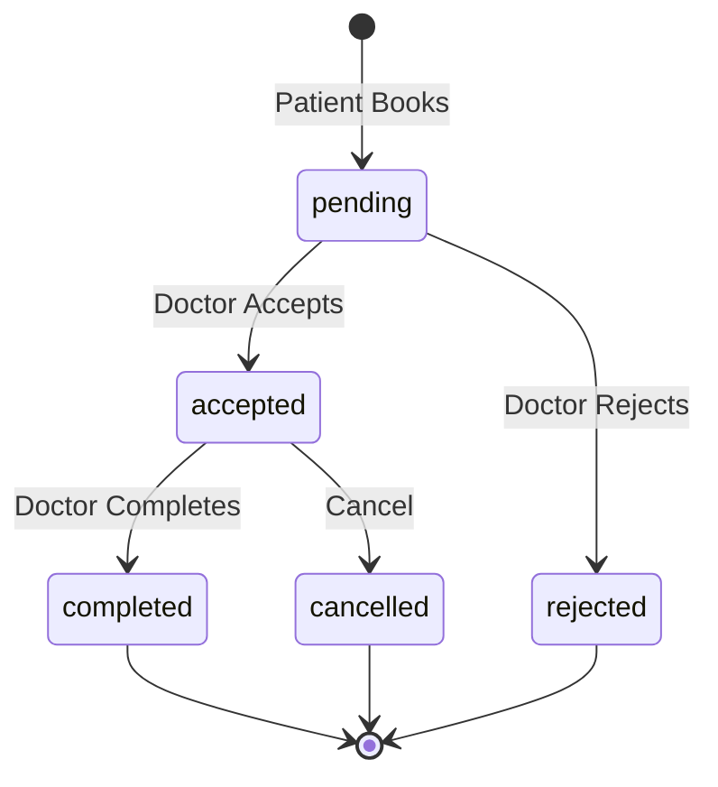

# Appointment Acceptance Workflow

This document describes the appointment acceptance system that ensures doctors explicitly accept patient appointments before any clinical actions can occur.

## Overview

When a patient books an appointment, it enters a **pending** state. The doctor must explicitly **accept** or **reject** the appointment. Only after acceptance can the doctor:
- Mark the appointment as completed
- Request access to patient's lab reports

## Appointment States



| Status | Description | Who can action |
|--------|-------------|----------------|
| `pending` | Waiting for doctor acceptance | Doctor: Accept/Reject |
| `accepted` | Doctor confirmed the appointment | Doctor: Complete, Cancel, Request Reports |
| `rejected` | Doctor declined (slot freed) | - |
| `completed` | Appointment finished | - |
| `cancelled` | Cancelled by either party | - |

---

## Backend Implementation

### Models

#### [appointment.py](file:///Users/sainacomputer/Desktop/8thsem/cuty-main/backend_fastapi/app/models/appointment.py)

```python
class AppointmentStatus(str, Enum):
    pending = "pending"
    accepted = "accepted"
    rejected = "rejected"
    completed = "completed"
    cancelled = "cancelled"
```

### Service Functions

#### [doctor_service.py](file:///Users/sainacomputer/Desktop/8thsem/cuty-main/backend_fastapi/app/services/doctor/doctor_service.py)

| Function | Description |
|----------|-------------|
| `accept_doctor_appointment()` | Accepts pending appointment, sends notification to patient |
| `reject_doctor_appointment()` | Rejects with optional reason, frees slot, notifies patient |
| `complete_doctor_appointment()` | Now requires `status == 'accepted'` |

#### [report_service.py](file:///Users/sainacomputer/Desktop/8thsem/cuty-main/backend_fastapi/app/services/user/report_service.py)

- `request_report_access()` now validates that appointment status is `'accepted'`

#### [user_service.py](file:///Users/sainacomputer/Desktop/8thsem/cuty-main/backend_fastapi/app/services/user/user_service.py)

- `book_appointment()` sets initial status to `'pending'`

### API Endpoints

#### Doctor Routes

| Method | Endpoint | Description |
|--------|----------|-------------|
| POST | `/api/doctor/accept-appointment` | Accept a pending appointment |
| POST | `/api/doctor/reject-appointment` | Reject with optional reason |

**Request Body:**
```json
// Accept
{ "appointmentId": "..." }

// Reject
{ "appointmentId": "...", "reason": "Optional rejection reason" }
```

---

## Frontend Implementation

### Types

#### [types/index.ts](file:///Users/sainacomputer/Desktop/8thsem/cuty-main/frontend/src/types/index.ts)

```typescript
export type AppointmentStatus = 'pending' | 'accepted' | 'rejected' | 'completed' | 'cancelled';

export interface Appointment {
    // ...existing fields
    status: AppointmentStatus;
    rejection_reason?: string;
}
```

### API Functions

#### [api/doctor.ts](file:///Users/sainacomputer/Desktop/8thsem/cuty-main/frontend/src/api/doctor.ts)

```typescript
export const acceptDoctorAppointment = async (appointmentId: string)
export const rejectDoctorAppointment = async (appointmentId: string, reason?: string)
```

---

## UI Changes

### Doctor Appointments Page

#### Pending Appointments
- Shows **Accept** and **Decline** buttons
- Clicking Decline opens a modal for optional rejection reason

#### Accepted Appointments
- Shows **Complete**, **Cancel**, and **Request Reports** buttons
- Report access request is only available here

#### Stats Bar
Shows counts for: Pending | Accepted | Completed | Cancelled/Declined

### User Appointments Page

| Status | Badge | Message |
|--------|-------|---------|
| pending | ⏳ Awaiting Confirmation | "Waiting for the doctor to confirm" |
| accepted | ✓ Confirmed | Shows cancel button |
| rejected | Declined | Shows rejection reason if provided |
| completed | Completed | - |
| cancelled | Cancelled | - |

---

## Notifications

| Event | Recipient | Message |
|-------|-----------|---------|
| Appointment Accepted | Patient | "Dr. [Name] has confirmed your appointment for [Date] at [Time]" |
| Appointment Rejected | Patient | "Dr. [Name] was unable to accept your appointment. Reason: [...]" |

---

## Report Access Integration

> [!IMPORTANT]
> Report access can **ONLY** be requested for appointments with `status: 'accepted'`

This ensures:
1. Doctor-patient relationship is confirmed
2. Patient knows who is requesting their data
3. No speculative access requests

---

## Migration Notes

For existing appointments without a `status` field, the system uses fallback logic:

```typescript
const getAppointmentStatus = (apt) => {
    if (apt.status) return apt.status;
    // Legacy fallback
    if (apt.cancelled) return 'cancelled';
    if (apt.isCompleted) return 'completed';
    return 'pending'; // or 'accepted' for old data
};
```

---

## Files Modified

### Backend
- `app/models/appointment.py` - Added status enum
- `app/services/doctor/doctor_service.py` - Accept/reject functions
- `app/services/user/report_service.py` - Status check for report access
- `app/services/user/user_service.py` - Initial pending status
- `app/routers/doctor/routes.py` - New endpoints

### Frontend
- `src/types/index.ts` - AppointmentStatus type
- `src/api/doctor.ts` - Accept/reject API functions
- `src/pages/doctor/Appointments.tsx` - Complete UI rewrite
- `src/pages/user/Appointments.tsx` - Status-aware display
