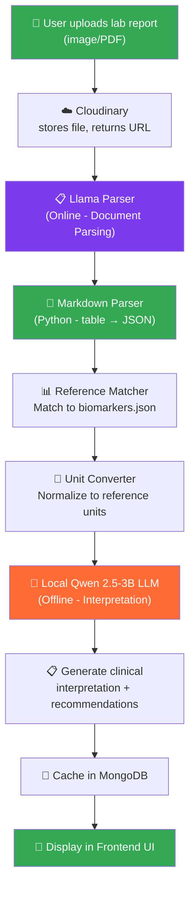
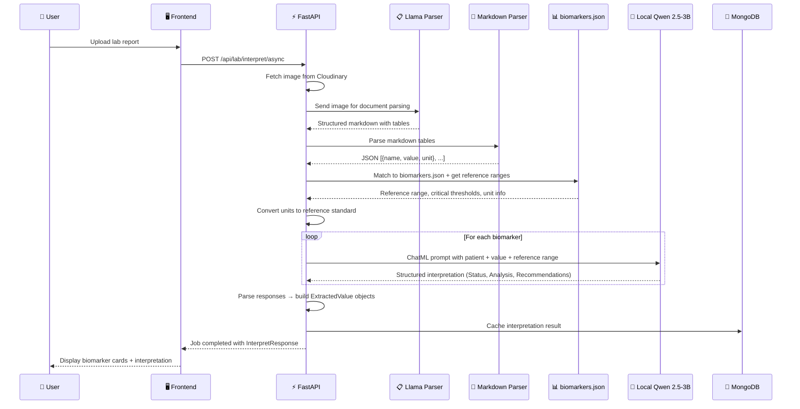
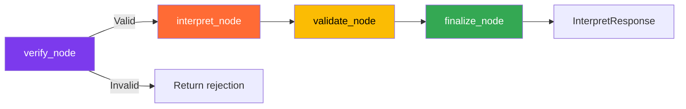
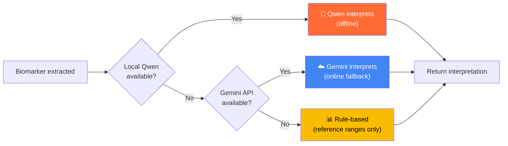

# Lab Report Interpretation Process — Complete Architecture

> **HealthMate** — AI-powered offline-first lab report interpretation

---

## Overview

The interpretation pipeline uses **two AI models** working together:

| Stage | Model | Purpose | Online? |
|-------|-------|---------|---------|
| **Extraction** | Llama Parser (LlamaIndex) | Read lab report image/PDF → structured markdown → JSON | ✅ Online |
| **Interpretation** | Fine-tuned Qwen 2.5-3B-Instruct (local GGUF) | Analyze extracted values → clinical interpretation | ❌ Offline |

> [!IMPORTANT]
> Llama Parser is used **ONLY** for document parsing (reading the image into structured text). All clinical interpretation is done by the local fine-tuned Qwen LLM, ensuring the core intelligence works **fully offline**.

---

## Architecture Flow



---

## Detailed Pipeline Steps

### Step 1: User Uploads Report
- User uploads lab report (PNG, JPG, or PDF) via the HealthMate app
- File is stored in **Cloudinary** and a secure URL is returned
- Frontend calls `POST /api/lab/interpret/async` with `report_id` and `patient_context`

### Step 2: Document Parsing & Verification (Llama Parser)
- **File:** `services/llama_parser_service.py`
- Llama Parser reads the document image/PDF and converts it to structured markdown
- If the markdown contains recognizable lab tables → image is valid
- If extraction fails or returns no tables → rejected as non-lab document
- Uses `LLAMA_API_KEY` for the LlamaIndex cloud service

### Step 3: Biomarker Extraction (Markdown Parser)
- **File:** `services/markdown_parser.py`
- Parses Llama Parser's markdown table output into structured JSON:
  - Detects column headers (Test Name, Result, Unit, Reference Range)
  - Handles variable formats (merged columns, different header names)
  - Extracts patient info (age, sex) from report headers
- Returns: `{name, value, unit}` for each biomarker
- **Runs fully offline** — pure Python regex/string parsing, no LLM

### Step 4: Reference Matching & Unit Conversion
- **Files:** `services/reference_loader.py`, `services/unit_converter.py`
- Matches extracted biomarker names to canonical IDs in `biomarkers.json` (119 biomarkers, 13 categories)
- Converts units to reference standard (e.g., mmol/L → mg/dL)
- Looks up ABIM reference ranges, critical thresholds, and sex/age-specific ranges
- **Runs fully offline** using local reference data

### Step 5: Clinical Interpretation (Local Qwen LLM) ⭐
- **File:** `services/qwen_interpreter.py`
- Takes the extracted + normalized biomarker data
- For **each biomarker**, constructs a prompt in the exact training format:
  ```
  Patient: Male, 55 years old.
  Test: Hemoglobin (hemoglobin)
  Result: 10.2 g/dL
  Reference Range: 14.0-18.0 g/dL
  Critical Thresholds: Critical Low: 7.0 | Critical High: 20.0 g/dL
  ```
- Wraps in ChatML format and sends to the fine-tuned Qwen model
- The LLM generates:
  - Status classification (Normal / Low / High / Critical Low / Critical High)
  - Numerical comparison against reference range
  - Clinical interpretation text
  - Personalized recommendations
  - Conclusion with action items
- **Runs fully offline** using local GGUF model via `llama-cpp-python`

### Step 6: Result Assembly & Caching
- **Files:** `graph/nodes.py` → `finalize_node()`, `services/background_processor.py`
- Assembles all interpreted values into `InterpretationResult`
- Generates summary (normal count, abnormal count, critical flags)
- Caches result in MongoDB for instant retrieval

### Step 7: Frontend Display
- **Files:** `LabAnalysisPage.tsx`, `BiomarkerTable.tsx`, `LabResultsModal.tsx`
- Polls job status via `GET /api/lab/interpret/status/{job_id}`
- Displays biomarker table with color-coded status indicators
- Shows clinical interpretation, AI summary, and patient context

---

## Data Flow Diagram



---

## Qwen LLM Integration Details

### Model Specifications

| Parameter | Value |
|-----------|-------|
| Base model | Qwen 2.5-3B-Instruct |
| Fine-tuning method | QLoRA (r=32, α=64, all linear layers) |
| Training data | 6,000 clinical examples across 119 biomarkers |
| Quantization | Q4_K_M (GGUF format, ~1.9GB file) |
| Model file | `Qwen2.5-3B-Instruct.Q4_K_M.gguf` |
| Runtime | `llama-cpp-python` (CPU inference, no GPU needed) |
| Context window | 2048 tokens |
| Temperature | 0.01 (near-deterministic for clinical accuracy) |
| Max output tokens | 384 |
| Device requirement | M1 Mac, 8GB RAM (runs comfortably in ~2GB) |

### Input Format (ChatML)

The fine-tuned model expects input in this exact format:

```
<|im_start|>system
You are a medical lab interpreter. Analyze lab results based on the provided reference ranges and provide clinical interpretations with recommendations.
<|im_end|>
<|im_start|>user
Patient: Male, 55 years old.
Test: Hemoglobin (hemoglobin)
Result: 10.2 g/dL
Reference Range: 14.0-18.0 g/dL
Critical Thresholds: Critical Low: 7.0 | Critical High: 20.0 g/dL
<|im_end|>
<|im_start|>assistant
```

> [!NOTE]
> The reference range is provided **in the input prompt**, so the model doesn't need to memorize ranges — it performs reasoning based on the given data. This is a key design choice called **Reference Range Anchoring** that prevents hallucination.

### Expected Output

```
**Analysis:**
- **Result:** 10.2 g/dL
- **Reference Range (Male):** 14.0-18.0 g/dL
- **Status:** Low

**Comparison:** 10.2 g/dL is below the lower limit of 14.0 g/dL.

**Interpretation:**
Low. Below the normal reference range. May indicate iron deficiency anemia, chronic disease, or nutritional deficiency.

**Recommendations:**
- Evaluate for iron deficiency anemia
- Consider B12 and folate testing

**Conclusion:**
Low. Follow-up testing recommended.
```

### Response Parsing

The structured markdown output is parsed into fields that map directly to the frontend's `ExtractedValue` model:

| Output Section | → Pydantic Field | Frontend Display |
|----------------|------------------|------------------|
| `**Status:** Low` | `status = "low"` | Color-coded badge |
| `**Interpretation:** ...` | `interpretation = "..."` | Biomarker detail text |
| `**Comparison:** ...` | Part of interpretation | Detailed analysis |
| `**Conclusion:** ...` | Feeds into `summary` | AI Insights tab |

---

## LangGraph Workflow

The interpretation pipeline is orchestrated by **LangGraph** with four nodes:



| Node | What It Does | Model Used |
|------|-------------|------------|
| `verify_node` | Extracts markdown, checks if it contains lab data | Llama Parser |
| `interpret_node` | Parses tables → matches refs → interprets each value | Markdown Parser + Qwen |
| `validate_node` | Rule-based plausibility and range checks | No LLM (pure logic) |
| `finalize_node` | Assembles response, counts abnormals, flags criticals | No LLM (pure logic) |

---

## File Structure

### Backend (`backend_fastapi/app/lab_interpreter/`)

```
lab_interpreter/
├── __init__.py                    # Module init + router registration
├── graph/
│   ├── nodes.py                   # LangGraph node functions
│   ├── state.py                   # LabReportState TypedDict
│   └── workflow.py                # Graph definition (verify→interpret→validate→finalize)
├── models/
│   ├── biomarker.py               # Biomarker + ReferenceRange models
│   └── interpretation.py          # ExtractedValue, InterpretResponse, PatientContext
├── routers/
│   ├── interpret_router.py        # REST API endpoints (/interpret, /interpret/async, /status)
│   ├── ocr_router.py              # OCR-specific endpoints
│   └── enrichment_router.py       # Biomarker enrichment endpoints
└── services/
    ├── llama_parser_service.py    # Llama Parser extraction (online)
    ├── markdown_parser.py         # Markdown table → JSON parser (offline)
    ├── qwen_interpreter.py        # Qwen interpretation orchestrator (offline)
    ├── qwen_inference.py          # GGUF model loading + inference via llama-cpp-python
    ├── validator_agent.py         # Rule-based validation checks (offline)
    ├── reference_loader.py        # Loads biomarkers.json reference data
    ├── unit_converter.py          # Unit conversion (mg/dL ↔ mmol/L etc.)
    ├── ocr_service.py             # EasyOCR fallback extraction (offline)
    ├── gemini_interpreter.py      # Legacy — used by HealthMate Assist only
    ├── verification_agent.py      # Legacy — used by HealthMate Assist only
    └── background_processor.py    # Async job processing
```

### Reference Data (`backend_fastapi/data/`)

| File | Purpose |
|------|---------|
| `biomarkers.json` (72KB) | 119 biomarkers with ABIM reference ranges, synonyms, critical thresholds |
| `unit_conversions.json` (34KB) | Unit conversion factors for all biomarkers |

### Model (`finetuning/qwen/model/`)

| File | Size | Purpose |
|------|------|---------|
| `Qwen2.5-3B-Instruct.Q4_K_M.gguf` | ~1.9GB | Fine-tuned quantized model for local inference |

### Frontend (`frontend/src/`)

| File | Purpose |
|------|---------|
| `api/labInterpret.ts` | API client (interpret, poll status, biomarkers) |
| `pages/user/LabAnalysisPage.tsx` | Full analysis page with progress polling |
| `components/LabResultsModal.tsx` | Modal view of interpretation results |
| `components/LabInterpretButton.tsx` | "Interpret Report" / "View Analysis" button |
| `components/BiomarkerTable.tsx` | Biomarker results table with status indicators |

---

## Fallback Strategy



| Priority | Method | Requirement | Quality |
|----------|--------|-------------|---------|
| 1️⃣ | Local Qwen LLM | GGUF model file present | High (fine-tuned on 6000 examples) |
| 2️⃣ | Gemini API (fallback) | Internet + API key | Very high |
| 3️⃣ | Rule-based comparison | `biomarkers.json` only | Basic (status only, no interpretation) |

---

## Current vs Previous Architecture

| Aspect | Previous (Gemini-only) | Current (Llama Parser + Qwen) |
|--------|------------------------|-------------------------------|
| Extraction | Gemini Vision | **Llama Parser** (document parsing) |
| Interpretation | Gemini (online) | **Qwen 2.5-3B (offline)** ⭐ |
| Offline capable | ❌ No | ✅ Yes (interpretation) |
| Speed | ~5-10s (API latency) | ~2-3s (local inference) |
| Cost per report | Gemini API tokens | Free (local interpretation) |
| Privacy | Data sent to Google | Data stays local (interpretation) |
| Accuracy | Very high (Gemini 2.5) | High (fine-tuned, 95%+ on 145 test cases) |
| Gemini dependency | Full | **None** for lab interpretation |
| Model size | Cloud (unknown) | 1.9GB local GGUF |

---

## Environment Configuration

```env
# Required for extraction (Llama Parser)
LLAMA_API_KEY=llx-your-api-key

# Required for local interpretation (Qwen)
QWEN_MODEL_PATH=/path/to/finetuning/qwen/model/Qwen2.5-3B-Instruct.Q4_K_M.gguf
```

### Python Dependencies

```
llama-parse>=0.5.0             # Document parsing (extraction)
llama-cpp-python>=0.2.0        # Local GGUF model inference
easyocr                        # Offline OCR fallback
langgraph                      # Workflow orchestration
```
